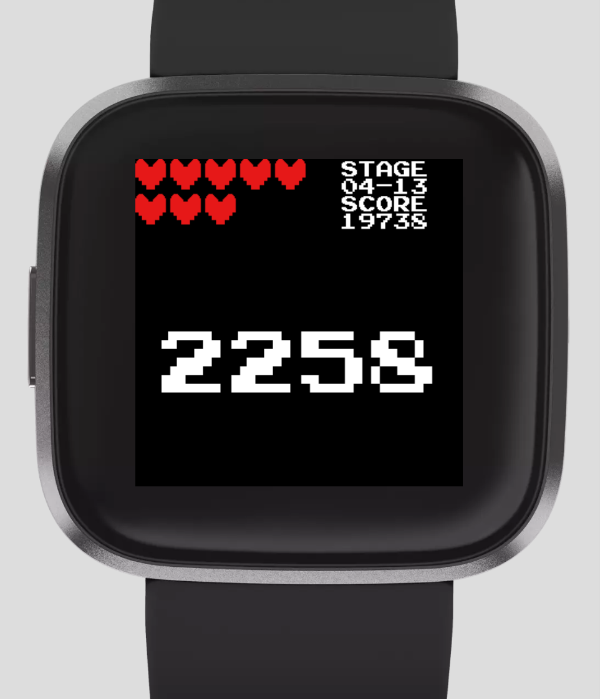

# pixel-retro-for-fitbit

Pixel Retro Clock for Fitbit Versa

## Description

Pixel Retro Clock is inspired by retro video games.

---

:heart: Heart Rate is represented by the number of hearts (a heart represents 10 Heart Rate)

:athletic_shoe: Steps is represented as `SCORE`

:calendar: Month and date are represented as `STAGE` (MM-DD)

:watch: Always-on Display

---

### Future Plan

See [Issues](https://github.com/tk3fftk/pixel-retro-for-fitbit/issues)
